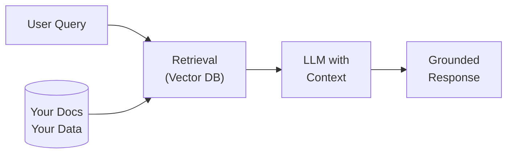
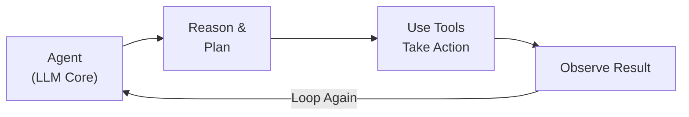
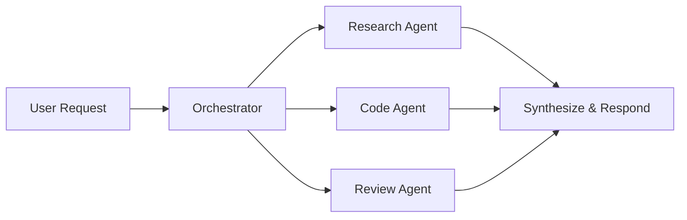

# Section 1: The Evolution of AI — And Why Software Comes First

⏱️ **Estimated reading time: 6 minutes**

## Contents

- [The Journey: From Chatbots to Agentic AI](#the-journey-from-chatbots-to-agentic-ai)
- [Context Engineering](#context-engineering)
- [AI Is Software Engineering](#ai-is-software-engineering)
- [References](#references)

---

## The Journey: From Chatbots to Agentic AI

---

## 🗓️ Timeline at a Glance

```
2022  ─── ChatGPT launches (Nov). The world notices LLMs.
2023  ─── RAG becomes the default pattern. "Ground your LLM in your data."
2024  ─── Agentic AI takes off. Agents use tools, reason in loops, take actions.
      ─── MCP (Model Context Protocol) introduced by Anthropic (Nov 2024).
2025  ─── Agent Skills emerge. Agents become composable and specialized.
      ─── MCP adopted by OpenAI, Google, Microsoft, and the broader ecosystem.
      ─── Standards bodies (LF AI & Data, CNCF, OASIS) begin formal standardization.
2026  ─── Industry shifts from "build an agent" to "orchestrate agent skills."
      ─── Cloud-native AI patterns mature. Production-grade agentic systems.
```

---


### Phase 1: Large Language Models (2022)

ChatGPT launched in November 2022. You ask a question, you get an answer. LLMs are next-token predictors trained on massive datasets.

**Limitation:** They only know what they were trained on. They can't access your data, call APIs, or take actions.

### Phase 2: Retrieval-Augmented Generation — RAG (2023)

RAG lets the LLM answer based on **your** data:



Retrieve relevant context → inject it into the prompt → get a grounded response.

**Limitation:** The LLM still can't *do* anything. It can only *talk about* your data.

### Phase 3: Agentic AI (2024)

AI systems started **taking actions**:



An agent receives a goal, reasons about what to do, uses tools (APIs, databases, code), observes the result, and loops until done.

### Phase 4: Multi-Agent Systems (2024–2025)

Multiple agents working together — an orchestrator delegates to specialized agents:



Frameworks like **Microsoft Agent Framework**, **LangGraph**, **CrewAI**, and **AutoGen** make this practical.

**Limitation:** Every new use case needs a new workflow. The orchestration code becomes the bottleneck.

### Phase 5: Agent Skills (2025–2026)

Instead of building a new workflow for every task, agents load **composable skills** — self-contained packages of knowledge, tools, and instructions.

| Agentic Workflows | Agent Skills |
|---|---|
| You define the graph ahead of time | The agent decides what to load at runtime |
| Adding a capability = new agent + new wiring | Adding a capability = drop in a new skill file |
| Best for deterministic, repeatable pipelines | Best for open-ended, exploratory tasks |

Modern models (Claude Sonnet/Opus 4, GPT-4o, Gemini 2.5 Pro) are capable enough to plan and orchestrate on their own. Earlier models needed hardcoded workflows because they couldn't reason through multi-step tasks reliably.

More on skills in [Section 3](03-agent-skills.md).

---

## Context Engineering

Multi-agent systems revealed a key insight: **the quality of an agent's output depends on the quality of its context — not prompting tricks.**

**Prompt engineering** is writing a good system prompt. **Context engineering** is designing the entire information architecture around the model — what it sees, when it sees it, and in what structure — across every turn.

| Aspect | What It Means |
|---|---|
| **What goes in** | System prompt, skill instructions, retrieved docs, tool schemas, conversation history |
| **What stays out** | Irrelevant context that dilutes attention — more isn't always better |
| **What gets summarized** | Long conversations compressed to preserve key decisions without hitting token limits |
| **What gets structured** | Raw data reformatted into schemas the model can reason about efficiently |

Skills are fundamentally a context engineering pattern: each skill injects domain-specific knowledge, instructions, and tool definitions into the agent's context at the right moment. The shift from workflows to skills was also a shift from *framework-managed context* to *model-consumed context designed for reasoning*.

For a concrete example of how frameworks like MAF(Microsoft Agentic Framework) manage context between agents — and where context engineering takes over — see [Real Example: Context Engineering in a Multi-Agent Framework](01a-real-context-engineering-example.md).

See [Anthropic's "Building Effective Agents"](https://www.anthropic.com/research/building-effective-agents) and [Simon Willison's "Context Engineering"](https://simonwillison.net/2025/Jun/27/context-engineering/) for more.

---

## AI Is Software Engineering

Every major pattern in agentic AI comes from software engineering. If you understand APIs, design patterns, and distributed systems, you already understand most of what makes AI agents work.

| Software Pattern | In AI Agents |
|---|---|
| **[Fan-out / Fan-in](https://learn.microsoft.com/en-us/azure/architecture/patterns/competing-consumers)** | Agent splits a task into subtasks, runs them in parallel, combines results |
| **[Orchestration](https://learn.microsoft.com/en-us/azure/architecture/patterns/choreography#when-not-to-use-this-pattern)** | A central agent coordinates sub-agents |
| **[Retry with Backoff](https://learn.microsoft.com/en-us/azure/architecture/patterns/retry)** | Agent retries a failed tool call |
| **[Circuit Breaker](https://learn.microsoft.com/en-us/azure/architecture/patterns/circuit-breaker)** | Agent stops calling a failing tool and uses an alternative |
| **[Pub/Sub](https://learn.microsoft.com/en-us/azure/architecture/patterns/publisher-subscriber)** | Agents communicate through message channels |
| **[Pipes and Filters](https://learn.microsoft.com/en-us/azure/architecture/patterns/pipes-and-filters)** | A request passes through a chain of processing agents |

**Example:** A user asks to compare cloud pricing. The agent fans out three tool calls (AWS, Azure, GCP), waits for all results, then synthesizes a comparison. Same pattern as MapReduce or Azure Durable Functions.

> The best AI engineers are the ones who already understand software engineering. AI is a powerful new component — but everything around it is software.

---

## References

- [Anthropic — "Building Effective Agents"](https://www.anthropic.com/research/building-effective-agents) — Guide on single-agent design
- [OpenAI — "A Practical Guide to Building Agents"](https://cdn.openai.com/business-guides-and-resources/a-practical-guide-to-building-agents.pdf) — Tool calling, guardrails, orchestration
- [Cloud Design Patterns — Microsoft Azure Architecture Center](https://learn.microsoft.com/en-us/azure/architecture/patterns/) — Software patterns used in AI
- [ReAct: Synergizing Reasoning and Acting in LLMs](https://arxiv.org/abs/2210.03629) — The foundational paper for agentic reasoning loops
- [Lilian Weng — "LLM Powered Autonomous Agents"](https://lilianweng.github.io/posts/2023-06-23-agent/) — Survey of agent architectures

---

**Next:** [Section 2 — Agent Concepts, Tools & MCP →](02-agent-concepts-tools-mcp.md)
