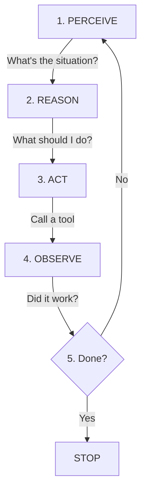

# Section 2: Agent Concepts, Tools & Model Context Protocol (MCP)

⏱️ **Estimated reading time: 5 minutes**

## Contents

- [What Is an AI Agent?](#what-is-an-ai-agent)
- [What Are Tools?](#what-are-tools)
- [Model Context Protocol (MCP)](#model-context-protocol-mcp)
- [Try It Yourself](#try-it-yourself)
- [References](#references)

---

## What Is an AI Agent?

An AI agent is **an LLM that can call tools and take actions** — not just generate text. A regular LLM answers questions. An agent can call APIs, read/write files, execute code, and decide what to do next in a goal-driven loop.

> **Key point:** Any model that can output structured function calls works as an agent core. You don't need a dedicated reasoning model. GPT-4o-mini, Claude Haiku, Gemini Flash — all work. Models that **don't** support tool calling (e.g., base completion models like raw Llama 2, older GPT-3, or fine-tuned text-only models without function calling training) cannot drive an agent loop.

### The Agent Loop (ReAct Pattern)



From the [ReAct paper (Yao et al., 2022)](https://arxiv.org/abs/2210.03629).

---

## What Are Tools?

Tools are **functions an agent can call** — the bridge between thinking (LLM) and doing (real world).

A tool has: **name**, **description**, **parameters**. The LLM reads these to decide *if* and *how* to use it.

### Tool Definition (OpenAI format)

```python
tools = [
    {
        "type": "function",
        "function": {
            "name": "get_weather",
            "description": "Get the current weather for a given city",
            "parameters": {
                "type": "object",
                "properties": {
                    "city": {"type": "string", "description": "City name, e.g. 'London'"},
                },
                "required": ["city"]
            }
        }
    }
]
```

### The Tool Calling Flow

1. You send a user message + tool definitions to the LLM
2. The LLM decides to call a tool and returns the function name + arguments
3. **Your code** executes the function (the LLM never runs it directly)
4. You send the result back to the LLM
5. The LLM generates a final response using the tool output

> **Full runnable example:** See [examples/simple-tool-calling](../examples/simple-tool-calling/) — a complete agent with two tools (weather + time).

### The Problem Before MCP

Every AI platform had its own tool format:

| Provider | Format | Specification |
|---|---|---|
| **OpenAI** (GPT-4o, etc.) | `tool_calls` array with `type: "function"` | [OpenAI function calling](https://platform.openai.com/docs/guides/function-calling) |
| **Anthropic** (Claude) | `tool_use` content blocks | [Anthropic tool use](https://docs.anthropic.com/en/docs/build-with-claude/tool-use) |
| **Google** (Gemini) | `function declarations` | [Gemini function calling](https://ai.google.dev/gemini-api/docs/function-calling) |

Every tool had to be integrated separately for each platform — until MCP.

---

## Model Context Protocol (MCP)

**MCP** is an open standard ([Anthropic, Nov 2024](https://www.anthropic.com/news/model-context-protocol)) that defines a **universal way for AI models to connect to tools and data.**

Think of it as **USB for AI tools** — build a tool once, connect it to any AI client.

### MCP Server Example (from this repo)

```python
from mcp.server.fastmcp import FastMCP

mcp = FastMCP("weather-server")

@mcp.tool()
def get_weather(city: str) -> str:
    """Get current weather for a city."""
    return f"Weather in {city}: 22°C, sunny"

@mcp.resource("weather://cities")
def list_cities() -> str:
    """List available cities."""
    return "Amsterdam, London, New York, Tokyo"

if __name__ == "__main__":
    mcp.run()
```

### Who Has Adopted MCP?

Anthropic (creator), **OpenAI**, **Microsoft** (GitHub Copilot, VS Code), **Google** (Gemini), plus Cursor, Windsurf, Zed, JetBrains, and hundreds of community servers on [mcp.so](https://mcp.so).

In December 2025, MCP became a founding project of the [Agentic AI Foundation (AAIF)](https://www.linuxfoundation.org/press/linux-foundation-announces-the-formation-of-the-agentic-ai-foundation) under the Linux Foundation, formalizing its role as an open industry standard.

---

## Try It Yourself

### 1. Set Up

From the repo root, run the setup script:

**Windows (PowerShell):**
```powershell
.\examples\setup.ps1
```

**macOS / Linux:**
```bash
bash examples/setup.sh
```

This creates a virtual environment, installs dependencies, and prompts for your OpenAI API key.

### 2. Run the Tool Calling Agent

```bash
cd examples/simple-tool-calling
python agent.py
```

### 3. Run the MCP Server

```bash
cd examples/mcp-weather-server
python server.py
```

Or test it interactively with the MCP Inspector (requires [Node.js](https://nodejs.org/)):

```bash
npx @modelcontextprotocol/inspector python server.py
```

This opens a browser UI where you can call tools and browse resources — no IDE or API key needed.

---

## References

- [MCP Specification](https://spec.modelcontextprotocol.io/) — The official protocol spec
- [MCP GitHub Organization](https://github.com/modelcontextprotocol) — SDKs for Python, TypeScript, Java, C#
- [OpenAI — Function Calling Guide](https://platform.openai.com/docs/guides/function-calling)
- [Anthropic — Tool Use Documentation](https://docs.anthropic.com/en/docs/build-with-claude/tool-use)
- [ReAct Paper (Yao et al., 2022)](https://arxiv.org/abs/2210.03629) — Reasoning + Acting pattern

---

**Previous:** [← Section 1 — Evolution of AI](01-evolution-of-ai.md)
**Next:** [Section 3 — Agent Skills →](03-agent-skills.md)
