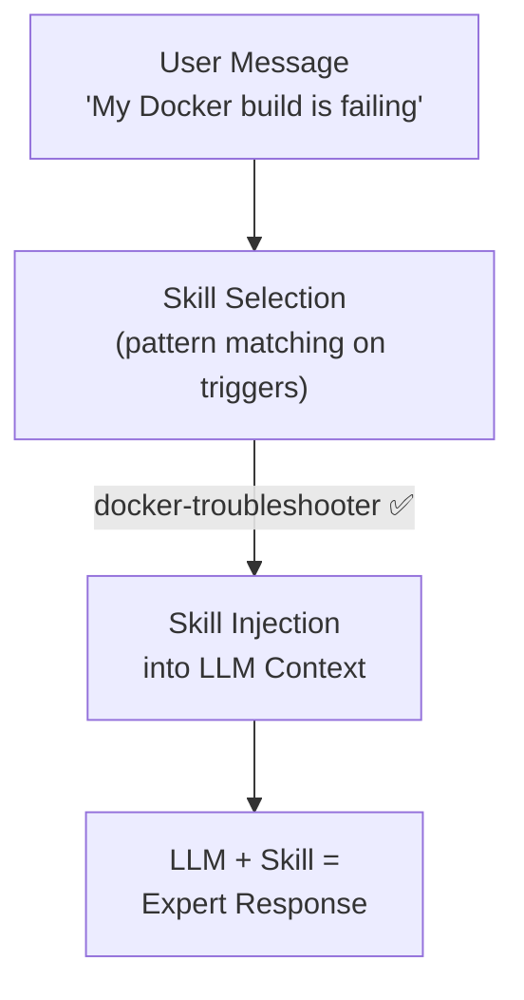
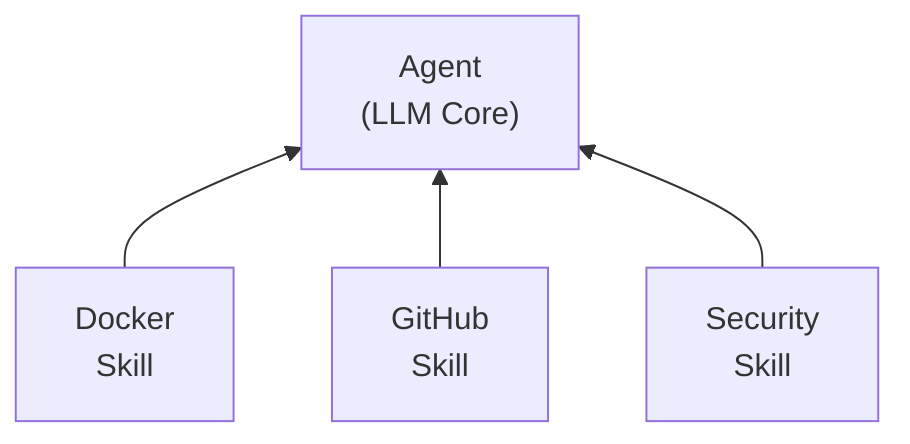

# Section 3: Agent Skills — What They Are and How They Work

⏱️ **Estimated reading time: 9 minutes**

## Contents

- [Prerequisites: What You Need to Use Skills](#️-prerequisites-what-you-need-to-use-skills)
- [What Are Agent Skills?](#what-are-agent-skills)
- [The Technical Anatomy of a Skill](#the-technical-anatomy-of-a-skill)
  - [The SKILL.md File — The Heart of a Skill](#the-skillmd-file--the-heart-of-a-skill)
  - [Example: A Simplified Skill File](#example-a-simplified-skill-file)
- [How Skills Work Under the Hood](#how-skills-work-under-the-hood)
- [Why Skills Are a Big Deal](#why-skills-are-a-big-deal)
- [Real-World Skill Examples](#real-world-skill-examples)
- [For the Technically Curious: How Skill Selection Works](#for-the-technically-curious-how-skill-selection-works)
- [Recommended Viewing](#-recommended-viewing)
- [References](#-references)

> An agent with tools can *do things*. An agent with skills can *be an expert* at things.

---

## ⚙️ Prerequisites

To try agent skills, you need one of these clients:

| Client | Type | Free Tier? |
|---|---|---|
| [GitHub Copilot](https://github.com/) | VS Code / JetBrains extension | [Free for students & teachers](https://github.com/settings/education/benefits) |
| [Claude Code](https://claude.ai/code) | Terminal / IDE / Desktop | Free plan available |

> **Full list of compatible clients:** [agentskills.io/clients](https://agentskills.io/clients)

Point the client at a repo with a `SKILL.md` file and the agent will discover and use it automatically.

---

## What Are Agent Skills?

**An agent skill is a self-contained package of knowledge, instructions, and tools that gives an agent specialized expertise in a specific domain.**

Think of it this way:

| Concept | Analogy | What It Provides |
|---|---|---|
| **LLM** | A smart person | General intelligence, reasoning |
| **Tool** | A screwdriver | One specific capability (call an API, read a file) |
| **Skill** | A certification + toolkit | Domain knowledge + instructions + relevant tools, all bundled together |

### A Simple Comparison

**Agent with a tool:**
> "I can call the GitHub API to create an issue."

**Agent with a skill:**
> "I know GitHub's best practices for issue templates, I know your repo's conventions, I know when to use labels vs. milestones, and I have tools to create issues, manage PRs, and check CI status — all working together."

---

## The Technical Anatomy of a Skill

A skill is typically a **structured file (or set of files)** that contains:

```
my-skill/
├── SKILL.md           # The core: instructions, knowledge, and behavior
├── references/        # Optional: reference docs, API specs
│   └── api-guide.md
├── scripts/           # Optional: helper scripts the skill can use
│   └── validate.py
└── assets/            # Optional: templates, schemas, examples
    └── template.json
```

### The SKILL.md File — The Heart of a Skill

A `SKILL.md` file is a structured Markdown document that tells the agent:

1. **When to activate** — What triggers this skill
2. **What it knows** — Domain-specific knowledge and context
3. **How to behave** — Step-by-step instructions and workflows
4. **What tools to use** — Which tools are relevant and how to use them

### Example: A Simplified Skill File

```markdown
---
name: docker-troubleshooter
description: Diagnose and fix common Docker issues
---

# Docker Troubleshooting Skill

## When to Use This Skill
Activate when the user asks about:
- Docker build failures
- Container networking issues
- Docker Compose problems
- Image size optimization

## Knowledge

### Common Docker Build Failures
1. **Missing dependencies** — Check that your base image includes required system packages
2. **Layer caching issues** — Order Dockerfile instructions from least to most frequently changed
3. **Multi-stage build errors** — Ensure COPY --from references the correct stage name

### Networking Troubleshooting
- Containers on the same Docker network can reach each other by container name
- Use `docker network inspect <network>` to verify connectivity
- Port mapping (`-p`) only affects host-to-container, not container-to-container

## Workflow

When the user reports a Docker issue:
1. Ask them to share the error message or Dockerfile
2. Identify the category (build, runtime, networking, compose)
3. Check for the common patterns listed above
4. Suggest a fix with explanation
5. If the fix involves code changes, provide the exact commands

## Tools Available
- `run_in_terminal` — Run docker commands to inspect state
- `read_file` — Read Dockerfile and docker-compose.yml
- `grep_search` — Search for patterns in configuration files
```

---

## How Skills Work Under the Hood

When you use an AI assistant (like GitHub Copilot), here's what happens:



**Key insight:** A skill doesn't change the LLM model. It changes the **context** the model works with. It's prompt engineering at scale — but organized, versioned, and composable.

### Progressive Disclosure (Anthropic's Model)

Anthropic's official design uses **three loading levels** so skills don't bloat the context window:

| Level | When loaded | Size | What |
|---|---|---|---|
| **1. Metadata** | Always (at startup) | ~100 tokens per skill | `name` + `description` from YAML frontmatter |
| **2. Instructions** | When the skill is triggered | < 5k tokens | The SKILL.md body |
| **3. Resources / code** | On demand via filesystem | Effectively unlimited | Bundled files (extra `.md`, scripts, schemas) — read only when referenced; script *output* enters context, not the script itself |

This means an agent can have hundreds of skills installed at near-zero cost — only the metadata is always loaded, and deeper content is pulled in only when needed.

> **Source:** [Anthropic — Equipping agents for the real world with Agent Skills](https://www.anthropic.com/engineering/equipping-agents-for-the-real-world-with-agent-skills) and the [Claude Docs — Agent Skills overview](https://platform.claude.com/docs/en/agents-and-tools/agent-skills/overview).

> **Why this works now:** Models got dramatically better at reasoning (2025+). See [Section 1 — "The Deeper Reason"](01-evolution-of-ai.md#the-deeper-reason-model-capability-caught-up) for the full explanation.

## Why Skills Are a Big Deal

### 1. They Solve the "Prompt Spaghetti" Problem

Without skills, complex agent behavior lives in:
- One massive system prompt
- Scattered custom instructions
- Hard-coded tool selection logic

With skills, each domain is **encapsulated** — just like how microservices encapsulate business logic.

### 2. They're Composable

An agent can load multiple skills simultaneously:



Ask it a question about Docker security on GitHub? It combines all three.

### 3. They're Shareable

Since skills are files (typically in a `.github/` or `.agents/` directory), they can be:
- **Committed to Git** — version controlled
- **Shared across teams** — via repos or registries
- **Open-sourced** — community skills for common tasks
- **Customized per project** — override defaults for your specific needs

---

## Real-World Skill Examples

| Skill | What It Does | File |
|---|---|---|
| **CV Tailor** | Tailors a student's CV to match a job description | [`examples/cv-tailor-skill/`](../examples/cv-tailor-skill/) |
| **Skill Creator** | Helps create new skills following SKILL.md best practices | [`examples/skill-creator-skill/`](../examples/skill-creator-skill/) |

> **Want to create your own skill?** Use the [Skill Creator](../examples/skill-creator-skill/SKILL.md) — it walks you through the structure, best practices, and common mistakes.

---

## For the Technically Curious: How Skill Selection Works

Skill selection is essentially a **routing problem** — the system needs to decide which skill(s) to activate for a given user message.

Common approaches:

1. **Keyword/pattern matching** — Simple but effective. The skill declares trigger phrases.
2. **Semantic similarity** — Embed the user message and skill descriptions, find closest match.
3. **LLM-based routing** — Ask a fast LLM "which skill should handle this?" before routing.
4. **User-explicit** — The user says "use the Docker skill" or selects it from a menu.

In practice, most systems use a **combination** — fast keyword matching first, with LLM-based fallback for ambiguous cases.

---

## 🎥 Recommended Viewing

- **[Intro to Agent Skills — by Anthropic](https://www.youtube.com/watch?v=CEvIs9y1uog&t=427s)** — Great overview of how the industry got from agents to **agent skills**.

---

## 📚 References

| # | Source | Date | Why It Matters |
|---|---|---|---|
| 1 | [GitHub — Customizing Copilot with Custom Instructions](https://docs.github.com/en/copilot/customizing-copilot/adding-custom-instructions-for-github-copilot) | 2025 | How to configure `.github/copilot-instructions.md` and skill files to guide agent behavior. |
| 2 | [GitHub Blog — "GitHub Copilot: The agent awakens"](https://github.blog/news-insights/product-news/github-copilot-the-agent-awakens/) | 2025 | Announcement of agent mode with skill-based architecture. |
| 3 | [Agent Skills — Open Standard](https://agentskills.io/home) | 2025–2026 | The official Agent Skills specification and documentation. Defines the SKILL.md format, client compatibility, and authoring best practices. |
| 4 | [Agent Skills — Client Showcase](https://agentskills.io/clients) | 2025–2026 | Full list of AI coding tools that support the Agent Skills format. |

---

**Previous:** [← Section 2 — Agent Concepts, Tools & MCP](02-agent-concepts-tools-mcp.md)  
**Next:** [Section 4 — Staying Current & Standards →](04-staying-current-and-standards.md)
