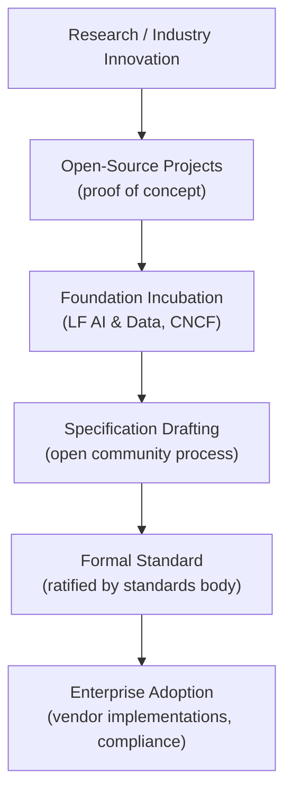
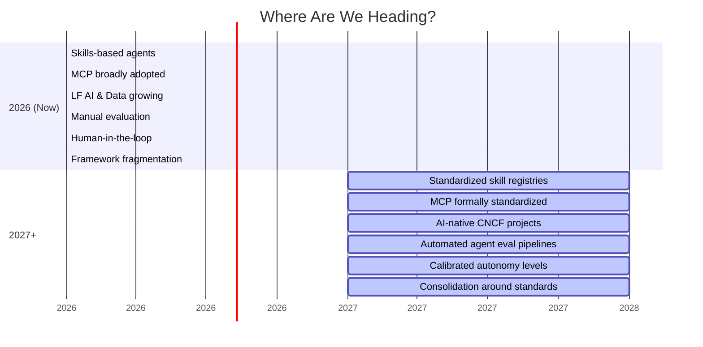

# Section 4: Staying Current & Standards — Separating Signal from Hype

⏱️ **Estimated reading time: 7 minutes**

## Contents

- [Standards Bodies That Matter for AI](#️-standards-bodies-that-matter-for-ai)
  - [The Linux Foundation Ecosystem](#the-linux-foundation-ecosystem)
  - [Other Important Bodies](#other-important-bodies)
  - [How Standards Flow](#how-standards-flow)
- [People to Follow](#-people-to-follow)
  - [Anthropic](#anthropic-claude-mcp-constitutional-ai)
  - [OpenAI](#openai-gpt-function-calling-agents-sdk)
  - [Google DeepMind & Google AI](#google-deepmind--google-ai)
  - [Microsoft & GitHub](#microsoft--github)
  - [Agent Frameworks & Developer Tools](#agent-frameworks--developer-tools)
  - [Standards, Governance & Industry Analysis](#standards-governance--industry-analysis)
  - [YouTube Channels & Podcasts](#youtube-channels--podcasts)
- [How to Stay Current Without Drowning](#-how-to-stay-current-without-drowning)
- [The Big Picture: Where Are We Heading?](#the-big-picture-where-are-we-heading)
- [References](#-references)

> In AI, the hype cycle moves faster than the standards cycle. Learn to tell them apart.

---

## ️ Standards Bodies That Matter for AI

These are the organizations that **actually standardize** AI technologies for enterprise and large-scale adoption:

### The Linux Foundation Ecosystem

The [Linux Foundation](https://www.linuxfoundation.org/) is the parent organization for most of the bodies that matter:

| Body | Focus | Key Projects | Website |
|---|---|---|---|
| **LF AI & Data Foundation** | Open-source AI/ML/Data projects | 67+ projects, responsible AI frameworks, Model Openness Framework (MOF) | [lfaidata.foundation](https://lfaidata.foundation/) |
| **CNCF** (Cloud Native Computing Foundation) | Cloud-native infrastructure | KServe (ML serving), Knative (serverless), Kubernetes | [cncf.io](https://www.cncf.io/) |
| **PyTorch Foundation** | Deep learning framework | PyTorch — the most widely used ML framework | [pytorch.org](https://pytorch.org/) |
| **OpenSSF** (Open Source Security Foundation) | Supply chain security | Relevant for AI model security and provenance | [openssf.org](https://openssf.org/) |

### Other Important Bodies

| Body | Focus | Why It Matters for AI |
|---|---|---|
| **OASIS Open** | Open standards development | Works on structured data, protocol, and trust standards that AI systems build on | [oasis-open.org](https://www.oasis-open.org/) |
| **NIST** (National Institute of Standards and Technology) | US government standards | AI Risk Management Framework (AI RMF) — the benchmark for responsible AI | [nist.gov/artificial-intelligence](https://www.nist.gov/artificial-intelligence) |
| **ISO/IEC** | International standards | ISO/IEC 42001 — AI Management System standard | [iso.org](https://www.iso.org/) |
| **IEEE** | Technical standards | Standards for AI ethics, transparency, and autonomous systems | [ieee.org](https://www.ieee.org/) |
| **W3C** | Web standards | Relevant as AI integrates with web platforms | [w3.org](https://www.w3.org/) |
| **OpenAPI Initiative** | API specifications | Foundation for how AI tools describe their interfaces | [openapis.org](https://www.openapis.org/) |

### How Standards Flow

> **Rule of thumb:** Technology moves fast. Standards move deliberately. The sweet spot is adopting technology that has **broad vendor support and is on a clear path to standardization** — even if the formal standard isn't finalized yet. MCP is a perfect example.

---

## 👤 People to Follow

These are builders, researchers, and practitioners who consistently share high-quality AI content. Prioritized for **technical depth**, not follower count.

### Anthropic (Claude, MCP, Constitutional AI)

| Person | Role | Platform | Why Follow |
|---|---|---|---|
| **Alex Albert** | Head of Claude Relations | [X](https://x.com/alexalbert__) | Inside perspective on Claude capabilities, MCP ecosystem, and developer experience. |
| **Jan Leike** | Alignment, Anthropic (formerly OpenAI) | [X](https://x.com/janleike) | Leads alignment research. Key voice on AI safety that affects how agents are designed. |

### OpenAI (GPT, Function Calling, Agents SDK)

| Person | Role | Platform | Why Follow |
|---|---|---|---|
| **Andrej Karpathy** | Former OpenAI / Tesla AI Director | [X](https://x.com/karpathy) • [YouTube](https://www.youtube.com/@AndrejKarpathy) | Best explanations of how LLMs work. His "Let's build GPT" series is the gold standard. |
| **Logan Kilpatrick** | Google AI (formerly OpenAI DevRel) | [X](https://x.com/OfficialLoganK) | Good bridge between AI research and developer experience. Active poster. |
| **Simon Willison** | Independent (heavy OpenAI/Claude user) | [X](https://x.com/simonw) • [Blog](https://simonwillison.net/) | The most prolific writer on practical AI tooling, MCP servers, and LLM capabilities. |

### Google DeepMind & Google AI

| Person | Role | Platform | Why Follow |
|---|---|---|---|
| **Jeff Dean** | Chief Scientist, Google DeepMind | [X](https://x.com/JeffDean) | One of the most influential people in AI. Posts about Gemini, scaling, and research direction. |
| **Demis Hassabis** | CEO, Google DeepMind | [X](https://x.com/demaboref) | Nobel laureate. Leads AlphaFold, Gemini, and DeepMind's research agenda. |
| **Jim Fan** | Senior Research Scientist, NVIDIA | [X](https://x.com/DrJimFan) | Covers agentic AI, embodied agents, and frontier research with great visual explainers. |

### Microsoft & GitHub

| Person | Role | Platform | Why Follow |
|---|---|---|---|
| **Satya Nadella** | CEO, Microsoft | [X](https://x.com/sataboref) • [LinkedIn](https://linkedin.com/in/satyanadella/) | Sets the vision for Copilot and AI across Microsoft. |
| **Thomas Dohmke** | CEO, GitHub | [X](https://x.com/ashtom) • [LinkedIn](https://linkedin.com/in/ashtom/) | Leads the Copilot product roadmap. Announces major agent mode updates. |
| **Kevin Scott** | CTO, Microsoft | [X](https://x.com/kevin_scott) | Microsoft's technical AI strategy. His "Behind the Tech" podcast covers AI infrastructure. |

### Agent Frameworks & Developer Tools

| Person | Role | Platform | Why Follow |
|---|---|---|---|
| **Harrison Chase** | CEO, LangChain | [X](https://x.com/hwchase17) | Builds the most popular agent framework. Good pulse on what developers actually build. |
| **Swyx (Shawn Wang)** | AI engineer, writer | [X](https://x.com/swyx) • [Podcast](https://www.latent.space/) | Coined "AI Engineer." His Latent Space podcast is essential listening for practitioners. |
| **Chip Huyen** | Author, AI engineer | [X](https://x.com/chipro) • [Blog](https://huyenchip.com/) | Wrote the go-to guide on building GenAI platforms. Practical, no-hype, production-focused. |
| **Cassidy Williams** | Developer advocate, AI educator | [X](https://x.com/cassidoo) | Makes complex AI concepts accessible. Great for developers new to the space. |
| **Rohit** | AI content creator | [X](https://x.com/rohit4verse) | Shares daily content that helps you make the most from AI. |

### Standards, Governance & Industry Analysis

| Person | Role | Platform | Why Follow |
|---|---|---|---|
| **Ibrahim Haddad** | Executive Director, LF AI & Data | [X](https://x.com/IbsHaddad) • [LinkedIn](https://linkedin.com/in/ibrahimhaddad/) | Directly leads AI standardization efforts at the Linux Foundation. |
| **Chris Aniszczyk** | CTO, CNCF | [X](https://x.com/caboref) | Leads the cloud-native foundation — the infrastructure AI runs on. |
| **Emad Mostaque** | AI policy commentator | [X](https://x.com/EMostaque) | Vocal on open-source AI, regulation, and industry dynamics. |
| **Gary Marcus** | NYU Professor, AI critic | [X](https://x.com/GaryMarcus) | Valuable skeptic. Helps you calibrate between hype and reality. |

### YouTube Channels & Podcasts

| Channel | Focus | Link |
|---|---|---|
| **Andrej Karpathy** | Deep technical LLM explainers | [YouTube](https://www.youtube.com/@AndrejKarpathy) |
| **Latent Space** (Swyx) | AI engineering podcast — the best one | [latent.space](https://www.latent.space/) |
| **AI Explained** | Balanced coverage of AI breakthroughs | [YouTube](https://www.youtube.com/@AiExplained-official) |
| **Fireship** | Quick, developer-focused AI updates | [YouTube](https://www.youtube.com/@Fireship) |
| **Two Minute Papers** | Research paper summaries | [YouTube](https://www.youtube.com/@TwoMinutePapers) |
| **GitHub** | Agent skills, Copilot updates, developer AI | [YouTube](https://www.youtube.com/@GitHub) |

---

## 🧭 How to Stay Current Without Drowning

AI moves fast. Here's a sustainable approach:

### The 15-Minute Daily Routine

1. **Scan X/Twitter** (5 min) — Follow the people above. Look for patterns, not individual takes.
2. **Read one blog post or paper summary** (5 min) — Lilian Weng, Simon Willison, or Latent Space.
3. **Check one standards body** (5 min) — LF AI & Data blog, CNCF blog, or MCP changelog.

### Red Flags: When to Ignore the Hype

🚩 **"This changes everything"** — Everything "changes everything" every week. Wait for production deployments.

🚩 **No open specification** — If the only way to use it is through one company's API, it's a product, not a platform.

🚩 **No governance model** — If one company controls the spec and can change it overnight, your dependency is a liability.

🚩 **Demo-only evidence** — "Look at this amazing demo!" Cool. Show me it working at scale for 6 months.

🚩 **Incompatible with standards** — If a new tool can't work with MCP, OpenAPI, or standard auth patterns, it's creating lock-in.

---

## The Big Picture: Where Are We Heading?

The developers who thrive will be those who:
1. **Build on standards** (MCP, OpenAPI, cloud-native patterns)
2. **Understand software fundamentals** (the patterns don't change)
3. **Stay curious but skeptical** (learn everything, adopt carefully)
4. **Share what they learn** (the community makes everyone better)

---

## 📚 References
| # | Source | Date | Why It Matters |
|---|---|---|---|
| 1 | [LF AI & Data Foundation](https://lfaidata.foundation/) | Ongoing | Linux Foundation's AI umbrella — 67+ projects, responsible AI frameworks, model openness standards. |
| 2 | [CNCF — Cloud Native AI Whitepaper](https://www.cncf.io/reports/cloud-native-artificial-intelligence-whitepaper/) | 2024 | CNCF's perspective on running AI workloads with cloud-native patterns — Kubernetes, observability, and governance. |
| 3 | [MCP Specification](https://spec.modelcontextprotocol.io/) | Nov 2024+ | The open specification this entire documentation references for tool interoperability. |
| 4 | [NIST AI Risk Management Framework (AI RMF 1.0)](https://www.nist.gov/artificial-intelligence/executive-order-safe-secure-and-trustworthy-artificial-intelligence) | 2024+ | US government framework for AI risk — the governance baseline many enterprises use. |
| 5 | [EU AI Act — Full Text](https://artificialintelligenceact.eu/) | Aug 2024 | The EU's comprehensive AI regulation — affects any AI system deployed in or serving the EU. |
| 6 | [OpenTelemetry — Semantic Conventions for GenAI](https://opentelemetry.io/docs/specs/semconv/gen-ai/) | 2024+ | Emerging standard for instrumenting LLM and agent systems — relevant to observability and evaluation. |

---

**Previous:** [← Section 3 — Agent Skills](03-agent-skills.md)  
**Back to:** [README →](../README.md)
